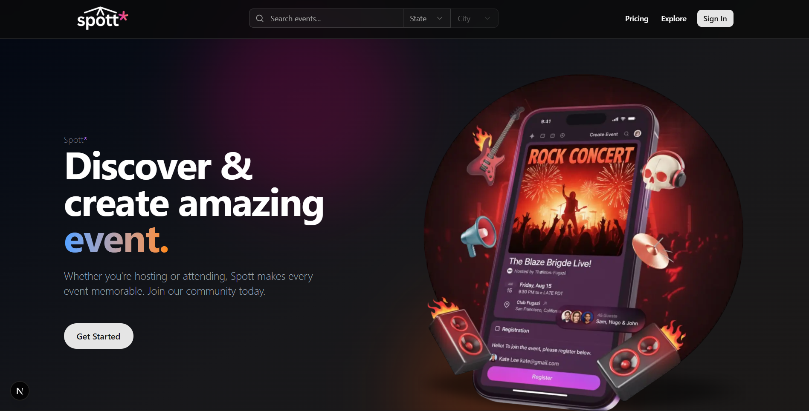
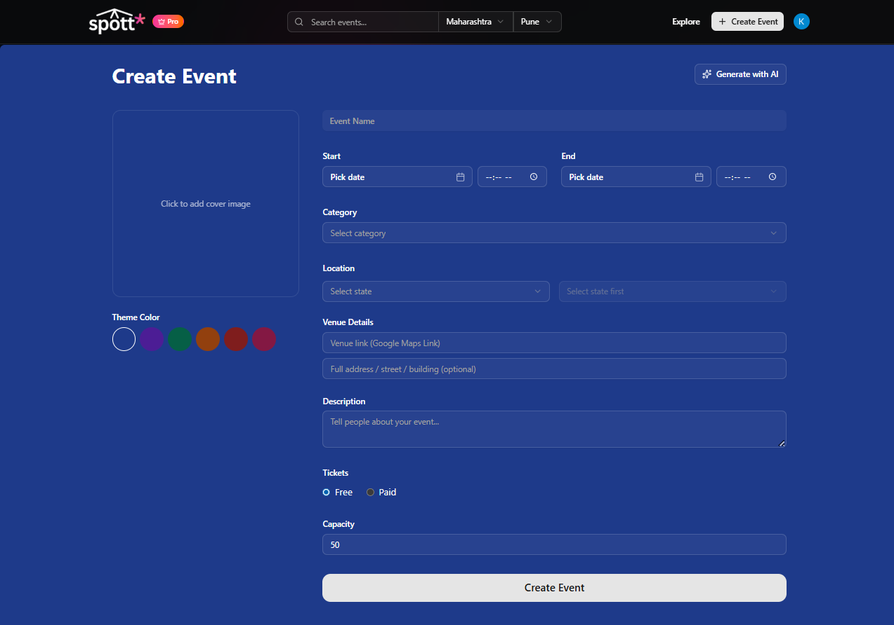
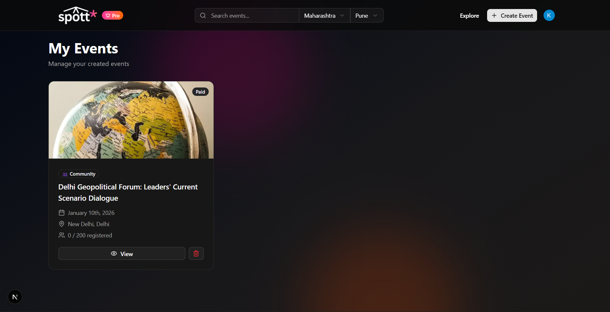
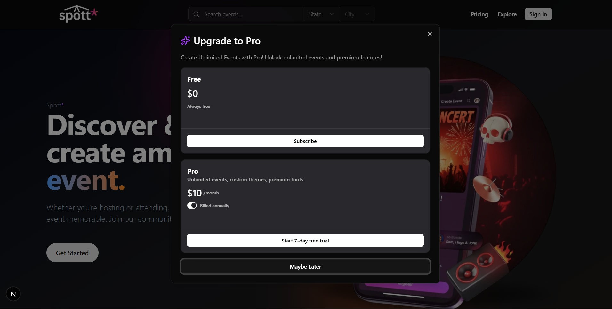

# 🎟️ Spott — AI-Powered Event Management Platform

Spott is a **full-stack, production-grade event management platform** that allows users to discover, create, manage, and attend events with ease.  
It combines **AI-powered event creation**, **role-based access**, **ticketing**, and **subscription-based monetization** into a modern, scalable web application.

Built using **Next.js App Router**, **Convex**, **Clerk Authentication**, and **Gemini AI**, Spott demonstrates real-world engineering practices and system design.

---

## 🚀 Key Features

### 👤 Authentication & User Management
- Secure authentication using **Clerk**
- Automatic user sync into Convex database
- Onboarding flow with:
  - Location selection
  - Interest preferences
- Role-based access (User / Organizer / Pro)

---

### 🎉 Event Creation & Management
- Create events with:
  - Title, description, category
  - Date & time (timezone aware)
  - Location (physical / online)
  - Capacity & ticket type
  - Cover image (Unsplash integration)
  - Theme customization
- Slug-based unique event URLs
- Organizer dashboard for managing events

---

### 🤖 AI Event Generator
- Generate event details using **Gemini AI**
- Converts a simple idea into:
  - Event title
  - Description
  - Category
  - Suggested capacity
  - Ticket type
- Strict JSON validation for safe backend usage

---

### 🎫 Ticketing & Registrations
- Users can:
  - Register for events
  - View tickets under **My Tickets**
  - Cancel registrations
- QR-based registration records
- Organizer access to attendee list

---

### 💎 Pro Subscription (Monetization)
- Subscription powered by **Clerk Billing**
- Free users:
  - Can create only **1 event**
  - Limited theme customization
- Pro users:
  - Unlimited event creation
  - Custom theme colors
  - Pro badge across the app

---

### 🔍 Search & Discovery
- Category-based event browsing
- Search by event title
- Location-based filtering
- Upcoming events sorted by date

---

### 🛡️ Security & Validation
- Server-side schema validation with Convex
- Auth-protected mutations and queries
- Ownership checks for:
  - Event edits
  - Registrations
  - Check-ins

---

## 🧱 Tech Stack

### Frontend
- **Next.js 14 (App Router)**
- **React**
- **Tailwind CSS**
- **shadcn/ui**
- **React Hook Form + Zod**

### Backend
- **Convex** (Database + Server Functions)
- **Convex Auth Integration**
- Schema-driven data modeling

### Authentication & Billing
- **Clerk Authentication**
- **Clerk Billing (Pro Plan)**

### AI Integration
- **Google Gemini (latest SDK)**
- Server-side AI generation via API routes

---

## 📸 Screenshots


### 🏠 Home / Explore Page


---

### 📝 AI Event Creation Dashboard


---

---

### 🏢 My Events (Organizer Dashboard)


---

### 💎 Pro Upgrade Modal


---

## ⚙️ Environment Variables

Create a `.env.local` file in the root directory:

```env
NEXT_PUBLIC_CLERK_PUBLISHABLE_KEY=your_key
CLERK_SECRET_KEY=your_key
CONVEX_DEPLOYMENT=your_deployment
NEXT_PUBLIC_CONVEX_URL=your_url
GEMINI_API_KEY=your_gemini_key


## 🧪 Getting Started

### 1️⃣ Clone the Repository
git clone https://github.com/your-username/spott.git  
cd spott  

### 2️⃣ Install Dependencies
npm install  

### 3️⃣ Start Convex
npx convex dev  

### 4️⃣ Run the Application
npm run dev  

Open 👉 http://localhost:3000